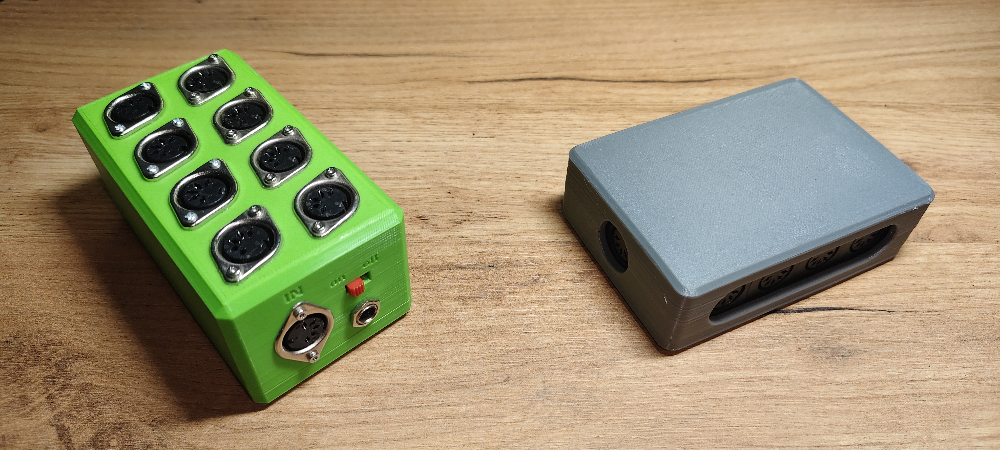
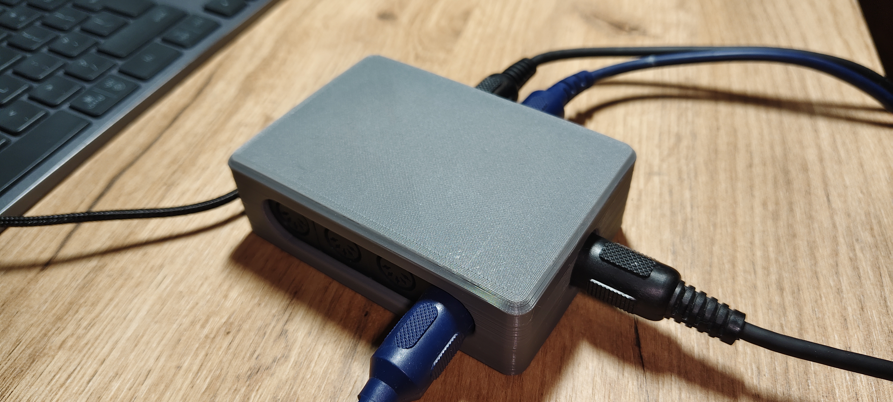

# Another MIDI Splitter V2

---

	

This is the second version of the [Another MIDI Splitter](https://www.instructables.com/Another-MIDI-Splitter/) project I published on Instructables. The previous version was difficult to assemble and not fully refined. This version improves several aspects of the original design.

## What is a MIDI splitter?

	

A MIDI splitter is a device that distributes a single MIDI source to multiple output ports. This allows you to connect several additional devices to a single controller. In its simplest form, it consists of several current buffers that replicate the input signal to multiple outputs. The circuit is simple and requires only a few logic gates and an optocoupler.

## Project structure

- `Mechanical` – Enclosure design  
- `Hardware` – PCB design

## Support

If you notice any issues, feel free to contact me.
